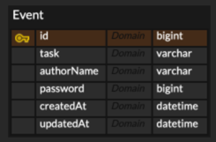

# 일정 관리 앱

## API 목록

| 기능 | HTTP Method | URL               | Request                                                                                                                   | Response                                                                                                                                                                                                                                                                                                                                                                                                                                                                                                                                                                                                                                       |
|------|------------|-------------------|---------------------------------------------------------------------------------------------------------------------------|------------------------------------------------------------------------------------------------------------------------------------------------------------------------------------------------------------------------------------------------------------------------------------------------------------------------------------------------------------------------------------------------------------------------------------------------------------------------------------------------------------------------------------------------------------------------------------------------------------------------------------------------|
| 일정 생성 | `POST` | `/api/tasks`      |  { &nbsp;&nbsp;"content": "string",  &nbsp;&nbsp;"authorName": "string",  &nbsp;&nbsp;"password": "long" } | 성공 시: `201 Created` { &nbsp;&nbsp;"id": long,  &nbsp;&nbsp;"content": "string",  &nbsp;&nbsp;"authorName": "string",  &nbsp;&nbsp;"createdAt": "localDateTime",  &nbsp;&nbsp;"updatedAt": "localDateTime" }                                                                                                                                                                                                                                                                                                                                                                                                               |
| 전체 일정 조회 | `GET` | `/api/tasks`      | 없음                                                                                                                        | 성공 시: `200 OK` [ &nbsp;&nbsp;{ &nbsp;&nbsp;&nbsp;&nbsp;"id": "long",  &nbsp;&nbsp;&nbsp;&nbsp;"content": "string",  &nbsp;&nbsp;&nbsp;&nbsp;"authorName": "string",  &nbsp;&nbsp;&nbsp;&nbsp;"createdAt": "localDateTime",  &nbsp;&nbsp;&nbsp;&nbsp;"updatedAt": "localDateTime" &nbsp;&nbsp;}, &nbsp;&nbsp;{ &nbsp;&nbsp;&nbsp;&nbsp;"id": "long",  &nbsp;&nbsp;&nbsp;&nbsp;"content": "String",  &nbsp;&nbsp;&nbsp;&nbsp;"authorName": "String",  &nbsp;&nbsp;&nbsp;&nbsp;"createdAt": "localDateTime",  &nbsp;&nbsp;&nbsp;&nbsp;"updatedAt": "localDateTime" &nbsp;&nbsp;} ] 없을 경우: `[]` |
| 선택 일정 조회 | `GET` | `/api/tasks/{id}` | 없음                                                                                                                        | 성공 시: `200 OK` { &nbsp;&nbsp;"id": "long",  &nbsp;&nbsp;"content": "string",  &nbsp;&nbsp;"authorName": "string",  &nbsp;&nbsp;"createdAt": "localDateTime",  &nbsp;&nbsp;"updatedAt": "localDateTime" } 실패 시: `404 Not Found`                                                                                                                                                                                                                                                                                                                                                                                         |
| 선택 일정 수정 | `PUT` | `/api/tasks/{id}` |  { &nbsp;&nbsp;"content": "string",  &nbsp;&nbsp;"authorName": "string",  &nbsp;&nbsp;"password": "long" } | 성공 시: `200 OK` { &nbsp;&nbsp;"id": "long",  &nbsp;&nbsp;"content": "string",  &nbsp;&nbsp;"authorName": "string",  &nbsp;&nbsp;"createdAt": "localDateTime",  &nbsp;&nbsp;"updatedAt": "localDateTime" } 실패 시: `404 Not Found`, `400 Bad Request`                                                                                                                                                                                                                                                                                                                                                                      |
| 선택 일정 삭제 | `DELETE` | `/api/tasks/{id}` | 없음                                                                                                                        | 성공 시: `200 OK` 실패 시: `404 Not Found`                                                                                                                                                                                                                                                                                                                                                                                                                                                                                                                                                                                                        |

## ERD
